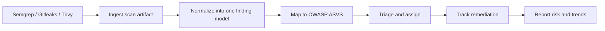
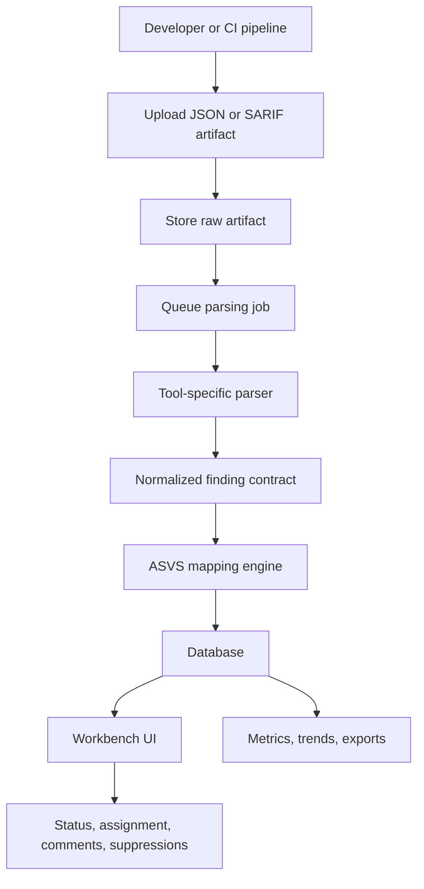
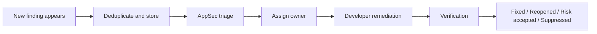
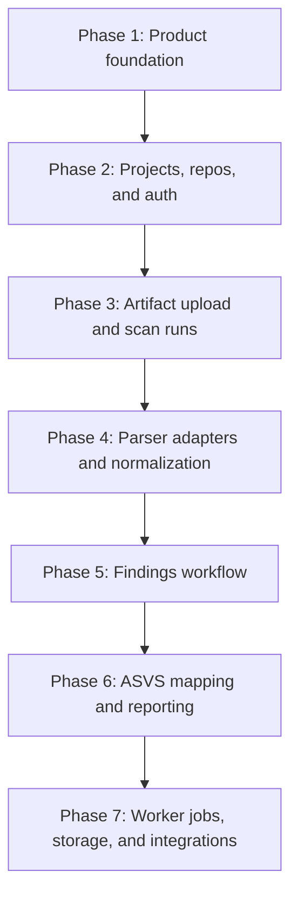

# AppSec Workbench

[Live demo](https://appsec-workbench.netlify.app)

AppSec Workbench is a security operations product concept for software teams. It takes raw findings from scanners like Semgrep, Gitleaks, and Trivy, turns them into one shared workflow, and helps teams decide what to fix first, who owns it, and how it maps to OWASP ASVS 5.0.0.

In plain language: this project is meant to feel like the kind of internal security dashboard an engineering organization would actually use, not just a page that shows scanner output.

## What this project is

- A portfolio-grade application security workflow product
- A React frontend prototype with a live multi-page experience
- A local NestJS API slice for findings data and workflow actions
- A foundation for a larger platform with ingestion, normalization, triage, and reporting

## Live status

- Public frontend: [https://appsec-workbench.netlify.app](https://appsec-workbench.netlify.app)
- Current host: Netlify
- Current state: frontend prototype with local API support during development

## Why it matters

Security tools usually answer only one question: "What did the scanner find?"

Real teams need answers to harder questions:

- Which findings are new?
- Which ones are real risk versus noise?
- Who owns the fix?
- How old is the issue?
- What standard or control does it affect?
- Are we getting better over time?

AppSec Workbench is designed around those questions.

## Who it is for

- Application Security Engineers who triage, tune, and track findings
- Security Analysts who review severity, trends, and remediation progress
- Developers and engineering leads who need clear ownership and fix guidance
- Managers who want a risk view without reading raw scan reports

## What you can see today

The current prototype includes:

- a multi-page React interface
- light and dark mode
- dashboard and findings views
- an interactive findings workflow
- local API-backed status, owner, comment, and history updates
- Netlify deployment for the frontend

The current live site is frontend-first. The full ingestion pipeline and production-style backend architecture are still part of the implementation roadmap below.

## Product idea in one diagram



## How the full platform would work



## How a finding moves through the system



## Implementation workflow

This is the clearest way to think about building the full product from the current prototype:



### Phase 1: Product foundation

- define the data model
- create the monorepo structure
- establish frontend and backend conventions

### Phase 2: Projects, repos, and auth

- local auth and RBAC
- organizations, projects, and repositories
- ownership and access model

### Phase 3: Artifact upload and scan runs

- upload reports manually
- create scan run records
- preserve raw artifacts and metadata

### Phase 4: Parser adapters and normalization

- parse Semgrep, Gitleaks, and Trivy outputs
- normalize them into one shared schema
- create fingerprints and dedupe logic

### Phase 5: Findings workflow

- findings list and detail pages
- status updates
- assignment
- comments and history
- suppressions and exceptions

### Phase 6: ASVS mapping and reporting

- load ASVS 5.0.0 requirements
- map findings to requirements
- add dashboards, trends, export views, and coverage analysis

### Phase 7: Worker jobs, storage, and integrations

- background parsing
- Redis and BullMQ
- object storage
- API-based ingestion
- Jira, GitHub Actions, and notification integrations

## Current technical architecture

- Frontend: React, Vite, TypeScript, React Router
- Backend prototype: NestJS + Prisma
- Main database target: PostgreSQL
- Worker target: Redis + BullMQ
- Object storage target: S3-compatible storage
- Deployment today: Netlify for the frontend

## Repository map

- [`apps/web`](./apps/web): frontend prototype and current deployed experience
- [`apps/api`](./apps/api): local API slice for findings workflow
- [`prisma/schema.prisma`](./prisma/schema.prisma): long-term main database model
- [`docs/architecture.md`](./docs/architecture.md): architecture notes
- [`docs/mvp-plan.md`](./docs/mvp-plan.md): implementation roadmap
- [`docs/netlify.md`](./docs/netlify.md): Netlify deployment notes
- [`netlify.toml`](./netlify.toml): Netlify monorepo build configuration

## Run locally

### Frontend only

```bash
cd apps/web
npm install
npm run dev
```

### Frontend + local API

```bash
cd apps/api
npm install
npm run db:setup
npm run dev
```

In a second terminal:

```bash
cd apps/web
npm install
npm run dev
```

## Deploy on Netlify

This repo is configured for Netlify frontend deployment.

- Base directory: `apps/web`
- Build command: `npm run build`
- Publish directory: `dist`

More detail is in [`docs/netlify.md`](./docs/netlify.md).

## What is implemented vs planned

### Implemented now

- product UI and navigation
- findings workflow prototype
- local API for finding detail and updates
- Netlify-ready frontend deployment

### Planned next

- real scan ingestion
- scanner-specific parsers
- ASVS seed loader and mapping engine
- project and repository CRUD
- background workers
- production-style persistence and reporting

## Project goal

The goal is not just to build a nice dashboard. The goal is to show the full thinking behind a serious AppSec product:

- data modeling
- workflow design
- security operations context
- developer experience
- technical implementation strategy

That is what makes AppSec Workbench a stronger portfolio project than a simple scanner wrapper.
